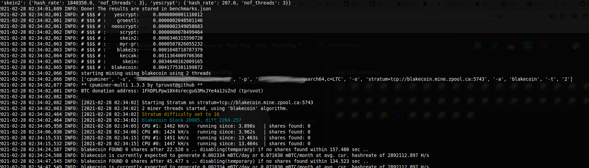

# Autoswitching ZPOOL CPU Miner

This one is a year 2021+ fork/rewrite from the below sources



## Usage

You can use thefollowing environment variables:
* `WALLET`
* `WORKERNAME`
* `PAYMETH`
* `WAITTIME`
configure which wallet to mine to and to set the worker name that will be passed along. Use the '-v' to point the container to a folder where the benchmark results can be stored, for example the current folder.


### 1.1: simple (single machine) example ( foreground)
`docker run -v $(pwd)/host_files:/host_files/ --rm -it -e WALLET=MTemuJQsCQsQ639nRBTDKnwJu2M4eyv9Tg -e WAITTIME=180 -e MAXTHREADS=2  -e WORKERNAME=worker1 -e PAYMETH=LTC -v $(pwd):/host_files/ coinsrus/docker-cpu-miner-zpool`

### 1.2: simple (single machine) example ( background)
`docker run --restart unless-stopped -v $(pwd)/host_files:/host_files/ --rm -t -d -e WALLET=MTemuJQsCQsQ639nRBTDKnwJu2M4eyv9Tg -e WAITTIME=180 -e MAXTHREADS=2  -e WORKERNAME=worker1 -e PAYMETH=LTC -v $(pwd):/host_files/ coinsrus/docker-cpu-miner-zpool`


## 2: docker swarm example( private registry )
* create a benchmark folder on each host:

  `mkdir /etc/zpool_host_files`
* pull , tag , add  to registry and deploy (update  this way as well ):
  ```
  docker pull coinsrus/docker-cpu-miner-zpool:latest;
  docker tag coinsrus/docker-cpu-miner-zpool:latest 192.168.111.1:5000/docker-cpu-miner-zpool;
  docker push 192.168.111.1:5000/docker-cpu-miner-zpool;
  docker service create  --name zpool_multi --replicas 3 --dns 9.9.9.9 --dns 1.1.1.1 --mount type=bind,src=/etc/zpool_host_files,dst=/host_files/  -e WALLET=MTemuJQsCQsQ639nRBTDKnwJu2M4eyv9Tg -e WAITTIME=180 -e MAXTHREADS=2 192.168.111.1:5000/docker-cpu-miner-zpool
```
  !!! do not forget to put your registry as insecure one in /etc/docker/daemon.json and reload(debian/ubuntu) or restart (openwrt) daemon
  ```
  {
  "insecure-registries" : ["192.168.111.1:5000"]
  }
  ```

* removing:
  ```
  docker service rm zpool_multi
  ```


This will first run a benchmark afther which it will start mining and it will save the `benchmarks.json` file locally so that it can be used with new versions of the container without the need to rerun the benchmarks. To force the benchmark again just remove the `benchmarks.json` file.

While running, the script will update the hash rates based on the actual hash rates of the algorithm. So small mistakes in the benchmark will be corrected while running. The optimal number of threads however is never updated and benchmark mistakes that are more than 20% will most likely not be corrected.

## SOURCES / FORK HISTORY

* https://github.com/Xuno/docker-cpu-miner-zpool.git
* * forked from https://github.com/pbutenee/docker-cpu-miner
* * * based on https://github.com/JayDDee/cpuminer-opt
* * * * based on https://github.com/tpuvrot/cpuminer

Docker image for running an autoswitching CPU miner for ZPOOL. The code is based on the cpu-miner-opt by JayDDee / tpuvrot
